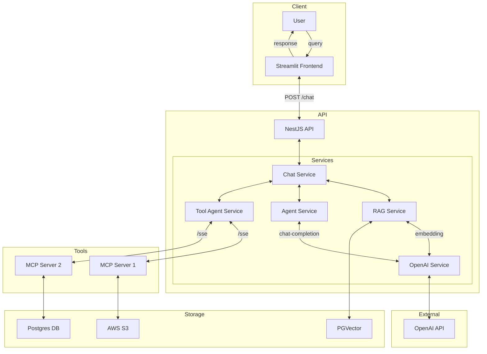

```mermaid
flowchart TB
    subgraph Client
        User["User"]
        Frontend["Streamlit Frontend"]
    end

    subgraph API
        NestJS["NestJS API"]
        subgraph Services
            ChatService["Chat Service"]
            AgentService["Agent Service"]
            ToolAgentService["Tool Agent Service"]
            RagService["RAG Service"]
            OpenAIService["OpenAI Service"]
        end
    end

    subgraph Tools
        MCP1["MCP Server 1"]
        MCP2["MCP Server 2"]
    end

    subgraph Storage
        LocalStack["AWS S3"]
        PGVector["PGVector"]
        PostgreSQL["Postgres DB"]
    end

    subgraph External
        OpenAI["OpenAI API"]
    end

    User -- "query" --> Frontend
    Frontend -- "response" --> User
    Frontend -- "POST /chat" <--> NestJS
    
    NestJS <--> ChatService
    ChatService <--> RagService
    ChatService <--> AgentService
    ChatService <--> ToolAgentService
    
    RagService -- "embedding" <--> OpenAIService
    RagService <--> PGVector
    
    ToolAgentService -- "/sse" <--> MCP1
    ToolAgentService -- "/sse" <--> MCP2
    
    AgentService -- "chat-completion" <--> OpenAIService
    
    OpenAIService <--> OpenAI
    
    MCP1 <--> LocalStack
    MCP2 <--> PostgreSQL
    
    %% Data flow
    class User,Frontend client
    class NestJS,ChatService,AgentService,ToolAgentService,RagService,OpenAIService api
    class MCP1,MCP2 tools
    class LocalStack,PostgreSQL storage
    class OpenAI external
```